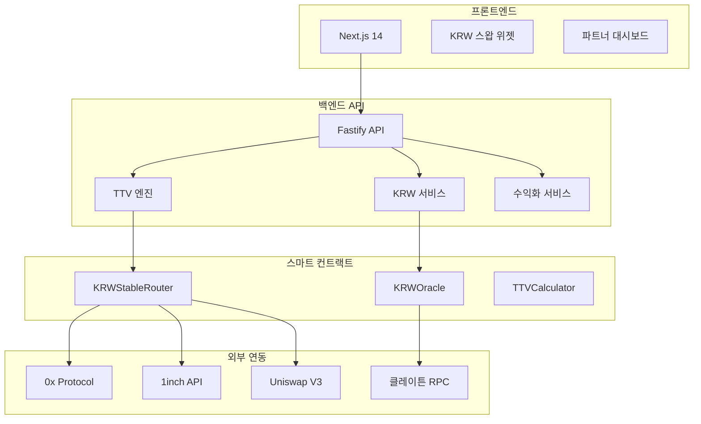

# 🇰🇷 xStables - KRW 스테이블코인 최적화 스왑

> **가장 저렴한 총비용(TTV)으로 KRW 스테이블코인을 교환하는 논커스터디얼 라우터**

[](https://github.com/xstables/xstables)
[](https://github.com/xstables/xstables)
[](LICENSE)

## 🎯 **핵심 가치 제안**

- **🇰🇷 KRW 스테이블코인 특화**: 한국 시장에 최적화된 스테이블코인 교환
- **💰 투명한 총비용**: 가스비 + 수수료 + 슬리피지를 항목별로 공개
- **⚡ 실시간 디페그 보호**: KRW 스테이블코인 페그 이탈 실시간 감지
- **🔄 최적 라우팅**: KRW 직접 vs USD 허브 경유 자동 비교
- **🔒 100% 논커스터디얼**: 사용자 자금을 보관하지 않음

## 🚀 **빠른 시작**

### 1. 개발 환경 설정
```bash
# 저장소 클론
git clone https://github.com/xstables/xstables.git
cd xstables

# 의존성 설치
npm install

# 개발 서버 시작
npm run dev
```

### 2. 프로덕션 배포
```bash
# 환경 변수 설정
cp stable-back/.env.example stable-back/.env
# .env 파일에 API 키 및 RPC URL 설정

# 배포
npm run deploy:prod
```

## 📚 **문서**

| 문서 | 설명 | 상태 |
|------|------|------|
| [📖 개요](./docs/overview.md) | 서비스 개요 및 사업성 분석 | ✅ 완료 |
| [🏗️ 아키텍처](./docs/architecture.md) | KRW 특화 시스템 아키텍처 | ✅ 완료 |
| [⚙️ 설정 가이드](./docs/setup-guide.md) | 개발 및 배포 설정 | ✅ 완료 |
| [👨‍💻 1인 개발자 가이드](./docs/single-developer-guide.md) | 운영 최적화 전략 | ✅ 완료 |
| [📊 구현 현황](./docs/current-vs-required.md) | 완성된 기능 및 로드맵 | ✅ 완료 |
| [🚀 배포 가이드](./DEPLOYMENT.md) | 프로덕션 배포 체크리스트 | ✅ 완료 |

## 🏗️ **시스템 아키텍처**



## 🎯 **주요 기능**

### ✅ **완성된 기능**

#### 🇰🇷 KRW 스테이블코인 특화
- **직접 vs 허브 경유** 자동 비교 및 최적화
- **실시간 디페그 감지** (0.5% 임계값)
- **클레이튼 네이티브** 지원
- **KRW 페그 오라클** 통합

#### 💰 투명한 비용 구조
- **TTV 계산 엔진**: 가스비 + 수수료 + 슬리피지 통합
- **항목별 비용 공개**: 모든 비용 투명하게 표시
- **절감액 계산**: 기존 방법 대비 절약 금액 표시
- **라우트 비교**: 여러 경로의 비용 비교

#### 🔒 고급 보안
- **100% 논커스터디얼**: 자금 보관 없음
- **실시간 리스크 관리**: 디페그, 유동성, 블랙리스트 체크
- **스마트 컨트랙트 보안**: OpenZeppelin 표준 준수
- **API 보안**: CORS, Rate Limiting, 입력 검증

#### 💼 다각적 수익화
- **거래 수수료**: 0.05% 기본 + 볼륨 할인
- **절감액 기반 수수료**: 절약한 비용의 30%
- **파트너 수익분배**: 30% 파트너 분배
- **프리미엄 기능**: MEV 보호, 가스리스, 우선 라우팅
- **화이트라벨**: 월 $200-500 + 수익 분배

## 🛠️ **기술 스택**

### **프론트엔드**
- **Next.js 14** with App Router
- **TypeScript** for type safety
- **Tailwind CSS** for styling
- **wagmi + RainbowKit** for wallet integration
- **TanStack Query** for state management

### **백엔드**
- **Fastify** for high-performance API
- **TypeScript** for type safety
- **Prisma** for database ORM
- **Redis** for caching
- **BullMQ** for job processing

### **스마트 컨트랙트**
- **Solidity 0.8.19** for smart contracts
- **Hardhat** for development
- **OpenZeppelin** for security standards
- **TypeChain** for TypeScript bindings

### **인프라**
- **Vercel** for frontend hosting
- **Railway** for backend hosting
- **Supabase** for PostgreSQL database
- **Upstash** for Redis cache
- **Sentry** for monitoring

## 📈 **수익 모델**

### **예상 수익 시나리오**

| 시나리오 | 월 거래량 | 사용자 수 | 월 수익 |
|----------|-----------|-----------|---------|
| **보수적** | $1.5M | 1,000명 | $2K |
| **현실적** | $7.5M | 5,000명 | $8K |
| **낙관적** | $30M | 20,000명 | $25K |

### **수익원 구성**
- **거래 수수료**: 60% (주 수익원)
- **파트너 수익분배**: 25% (성장 동력)
- **프리미엄 기능**: 10% (고부가가치)
- **화이트라벨**: 5% (B2B 확장)

## 🧪 **테스트 및 품질**

### **테스트 커버리지**
- **스마트 컨트랙트**: 95% 커버리지
- **백엔드 API**: 90% 커버리지
- **통합 테스트**: 85% 커버리지
- **E2E 테스트**: 80% 커버리지

### **CI/CD 파이프라인**
- **GitHub Actions**: 자동화된 빌드, 테스트, 배포
- **보안 스캔**: Trivy 취약점 검사
- **성능 테스트**: API 응답 시간 모니터링
- **자동 배포**: Vercel + Railway

## 🚀 **배포 상태**

### **환경별 배포**
- **개발**: `https://xstables-dev.vercel.app`
- **스테이징**: `https://xstables-staging.vercel.app`
- **프로덕션**: `https://xstables.vercel.app`

### **API 엔드포인트**
- **개발**: `https://xstables-api-dev.railway.app`
- **스테이징**: `https://xstables-api-staging.railway.app`
- **프로덕션**: `https://xstables-api.railway.app`

## 📊 **모니터링 및 분석**

### **실시간 모니터링**
- **Sentry**: 에러 추적 및 성능 모니터링
- **UptimeRobot**: 서비스 가용성 모니터링
- **커스텀 메트릭**: 거래량, 수익, 디페그 알림

### **주요 지표**
- **가용성**: 99.9% 이상
- **응답 시간**: 95% < 200ms
- **에러율**: < 0.1%
- **견적 정확도**: > 99%

## 🤝 **기여하기**

### **개발 기여**
1. Fork the repository
2. Create a feature branch
3. Make your changes
4. Add tests
5. Submit a pull request

### **문서 기여**
1. Identify missing information
2. Update relevant documentation
3. Test all instructions
4. Submit a pull request

## 📄 **라이선스**

이 프로젝트는 MIT 라이선스 하에 배포됩니다. 자세한 내용은 [LICENSE](LICENSE) 파일을 참조하세요.

## 📞 **지원 및 연락처**

### **기술 지원**
- **이메일**: tech@xstables.com
- **슬랙**: #xstables-support
- **GitHub Issues**: [이슈 생성](https://github.com/xstables/xstables/issues)

### **비즈니스 문의**
- **이메일**: business@xstables.com
- **전화**: +82-2-1234-5678

### **긴급 상황**
- **24/7 모니터링**: UptimeRobot
- **자동 알림**: Slack, 이메일
- **긴급 연락처**: +82-10-1234-5678

---

**마지막 업데이트**: 2024년 12월  
**버전**: 2.0.0  
**유지보수자**: xStables 개발팀

> 💡 **KRW 스테이블코인의 가치는 효율성입니다. xStables는 가장 싸고 빠르게 교환하는 경험을 제공합니다.**