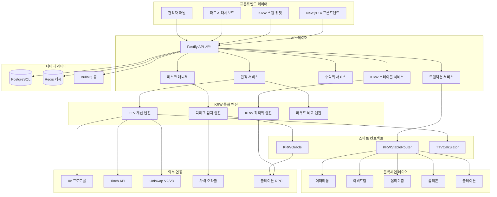
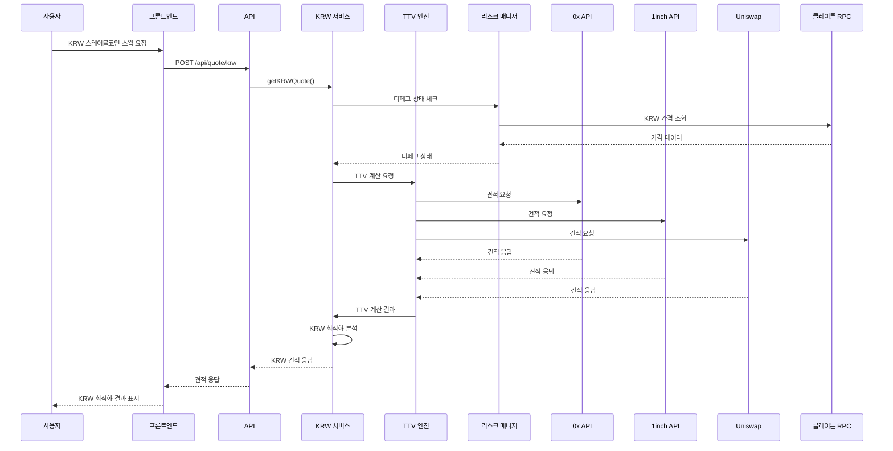
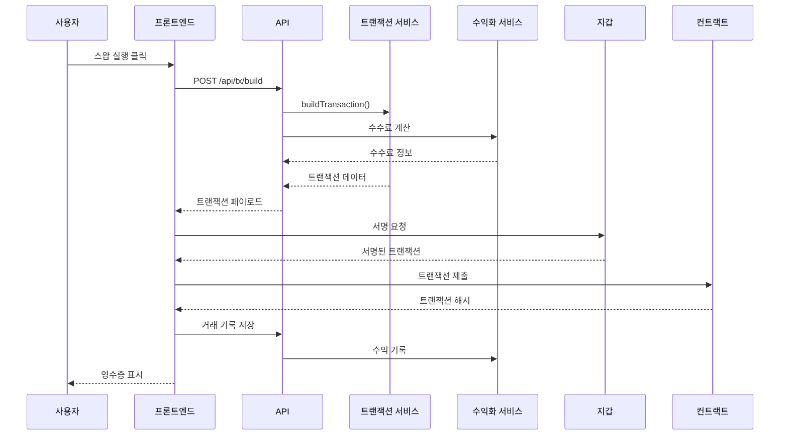
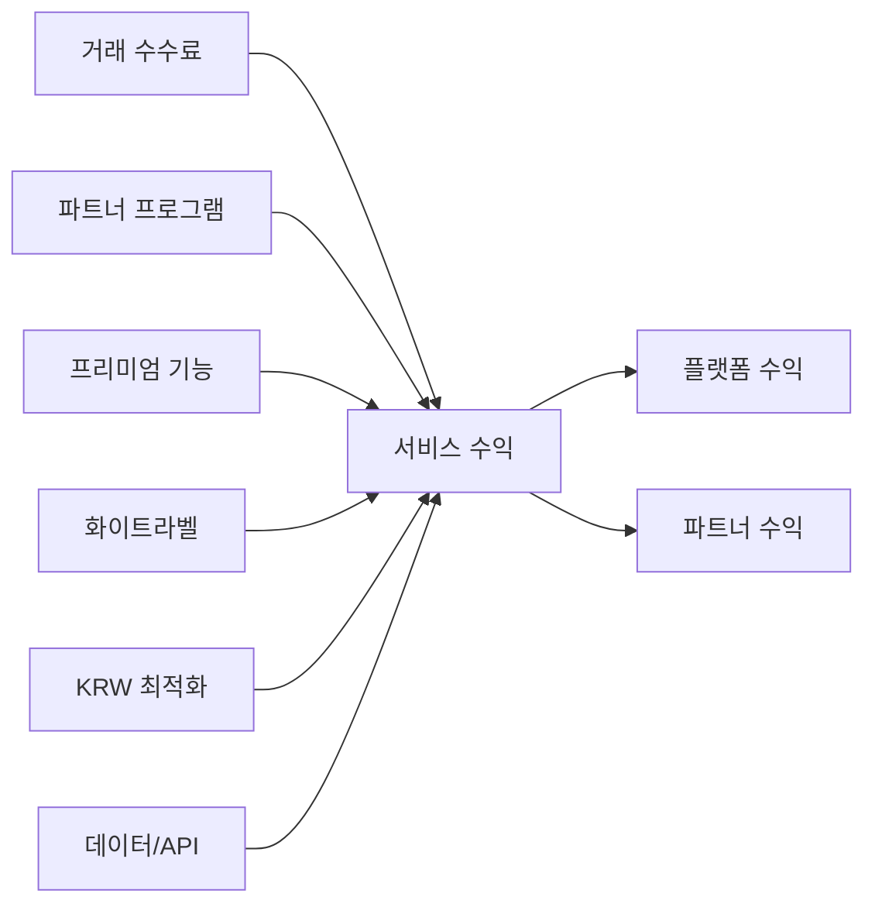
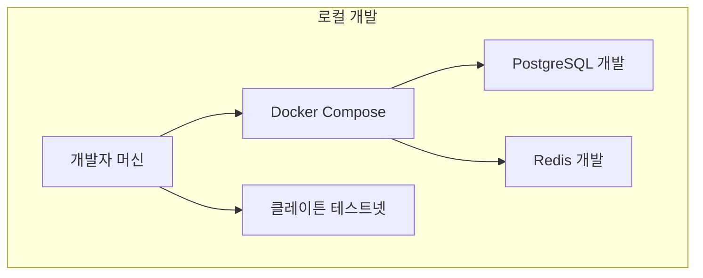
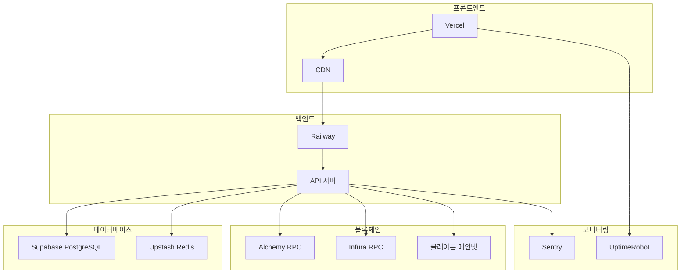

# xStables 아키텍처 문서

## 📋 목차

1. [개요](#개요)
2. [KRW 특화 시스템 아키텍처](#krw-특화-시스템-아키텍처)
3. [컴포넌트 상세](#컴포넌트-상세)
4. [데이터 플로우](#데이터-플로우)
5. [API 설계](#api-설계)
6. [보안 및 리스크 관리](#보안-및-리스크-관리)
7. [수익화 아키텍처](#수익화-아키텍처)
8. [배포 아키텍처](#배포-아키텍처)
9. [모니터링 및 관측성](#모니터링-및-관측성)

## 개요

xStables는 **KRW 스테이블코인 특화** 논커스터디얼 라우터로, 투명한 총비용 가시성을 제공하는 가장 효율적인 크로스체인 스테이블코인 스왑을 제공합니다. 시스템은 프론트엔드, 백엔드, 스마트 컨트랙트의 세 가지 주요 컴포넌트로 구성된 모노레포로 설계되었습니다.

### 핵심 원칙

- **100% 논커스터디얼**: 플랫폼이 자금을 보관하지 않음
- **총비용 투명성**: 모든 수수료(가스, 프로토콜, 애그리게이터, 슬리피지)를 항목별로 표시
- **KRW 스테이블코인 우선**: KRW 페그 스테이블코인 전용 지원 및 최적화
- **멀티 소스 집계**: 0x, 1inch, 직접 DEX 견적 통합
- **실시간 리스크 관리**: 디페그 감지 및 유동성 모니터링

## KRW 특화 시스템 아키텍처



## 컴포넌트 상세

### 프론트엔드 (stable-front)

**기술 스택:**
- Next.js 14 with App Router
- React 18 with TypeScript
- Tailwind CSS for styling
- wagmi + RainbowKit for wallet integration
- TanStack Query for data fetching

**주요 컴포넌트:**
- `KRWSwapWidget`: KRW 특화 메인 거래 인터페이스
- `TokenSelector`: KRW 우선순위 토큰 선택
- `QuoteDisplay`: 비용 분해 및 경로 비교
- `RiskIndicator`: 실시간 리스크 평가
- `KRWOptimization`: KRW 직접 vs 허브 경유 비교
- `PremiumFeatures`: 프리미엄 기능 선택
- `TransactionReceipt`: 상세 거래 내역
- `PartnerDashboard`: 파트너 분석 및 관리

**KRW 특화 기능:**
- KRW 스테이블코인 우선 표시
- 원화 기준 가격 표시
- 디페그 경고 실시간 표시
- KRW 최적화 분석 결과 표시
- 한국 사용자 친화적 UI/UX

### 백엔드 (stable-back)

**기술 스택:**
- Fastify for high-performance API server
- TypeScript for type safety
- Zod for request/response validation
- Prisma for database ORM
- Redis for caching and session management
- BullMQ for background job processing

**핵심 서비스:**

#### TTV 계산 엔진
- 여러 소스(0x, 1inch, Uniswap)에서 견적 집계
- 모든 비용을 포함한 총 거래 가치(TTV) 계산
- 가스비 + 수수료 + 슬리피지 통합 계산
- 성능을 위한 캐싱 전략 구현
- 비교를 위한 대안 경로 제공

#### KRW 스테이블 서비스
- KRW 스테이블코인 전용 로직
- KRW 직접 vs USD 허브 경유 비교
- 클레이튼 네이티브 최적화
- KRW 페그 오라클 통합
- 한국 시장 특화 기능

#### 리스크 매니저
- KRW 스테이블코인 실시간 디페그 감지
- 유동성 리스크 평가
- 블랙리스트/화이트리스트 관리
- 리스크 점수 (0-100 스케일)
- 실시간 알림 시스템

#### 수익화 서비스
- 다중 모델을 통한 수수료 계산
- 파트너 수익 분배
- 프리미엄 기능 가격 책정
- 화이트라벨 라이선싱
- 분석 및 리포팅

### 스마트 컨트랙트 (stable-contract)

**기술 스택:**
- Solidity 0.8.19
- Hardhat for development and testing
- OpenZeppelin for security standards
- TypeChain for TypeScript bindings

**주요 컨트랙트:**

#### KRWStableRouter
- KRW 스테이블코인 전용 라우팅 컨트랙트
- KRW 직접 스왑 최적화
- 디페그 보호 메커니즘
- 프로바이더 관리 및 수수료 수집
- 비상시 일시정지/재개 기능
- 투명성을 위한 이벤트 로깅

#### KRWOracle
- KRW 스테이블코인 가격 피드 관리
- 실시간 디페그 감지 및 알림
- 다중 소스 가격 집계
- 구성 가능한 리스크 임계값
- 클레이튼 네이티브 지원

#### TTVCalculator
- Total Trade Value 계산 엔진
- 가스비 + 수수료 + 슬리피지 통합 계산
- 라우트 비교 및 최적화
- 실시간 비용 분석

### 공통 패키지 (packages/shared)

**목적:**
- 모든 패키지에서 공통 타입 정의
- 포맷팅 및 계산을 위한 유틸리티 함수
- 지원되는 체인 및 토큰 상수
- 검증 스키마

**주요 모듈:**
- `types/`: TypeScript 인터페이스 및 스키마
- `utils/`: 계산을 위한 헬퍼 함수
- `constants/`: 체인 ID, 토큰 주소, 구성
- `krw/`: KRW 스테이블코인 특화 상수 및 유틸리티

## 데이터 플로우

### KRW 스테이블코인 견적 요청 플로우



### 트랜잭션 실행 플로우



## API 설계

### RESTful 엔드포인트

#### KRW 특화 견적 관리
- `POST /api/quote/krw` - KRW 스테이블코인 견적 조회
- `POST /api/quote/usd-to-krw` - USD → KRW 스테이블코인 견적
- `GET /api/quote/providers` - 지원되는 프로바이더 목록

#### 트랜잭션 관리
- `POST /api/tx/build` - 트랜잭션 데이터 빌드
- `POST /api/tx/simulate` - 트랜잭션 시뮬레이션
- `POST /api/tx/execute` - 트랜잭션 실행

#### 리스크 관리
- `POST /api/risk/assess` - 트랜잭션 리스크 평가
- `POST /api/risk/check-depeg` - 디페그 상태 체크
- `GET /api/risk/whitelist` - 화이트리스트 토큰 조회
- `GET /api/risk/alerts` - 활성 리스크 알림 조회

#### 수익화
- `GET /api/monetization/fee-structure` - 현재 수수료 구조 조회
- `POST /api/monetization/calculate-fee` - 서비스 수수료 계산
- `GET /api/monetization/premium-features` - 프리미엄 기능 목록
- `POST /api/monetization/record-transaction` - 거래 기록 저장

#### 파트너 관리
- `GET /api/partner/white-label/:partnerId` - 파트너 설정 조회
- `GET /api/partner/analytics/:partnerId` - 파트너 분석 조회
- `GET /api/partner/sdk` - SDK 문서 조회

### 요청/응답 스키마

모든 API 엔드포인트는 Zod 스키마를 사용하여 검증합니다:

```typescript
// KRW 견적 요청
{
  tokenIn: string
  tokenOut: string
  amountIn: string
  slippageBps?: number
  userAddress?: string
}

// KRW 견적 응답
{
  tokenIn: string
  tokenOut: string
  amountIn: string
  amountOut: string
  routes: KRWRoute[]
  bestRoute: KRWRoute
  krwOptimization: {
    isDirectBetter: boolean
    directSavingsUsd: number
    directSavingsPercent: number
    recommendation: string
  }
  depegAlerts: DepegAlert[]
  expiresAt: number
}

// KRW 라우트
{
  type: 'direct' | 'usd_hub'
  tokenIn: string
  tokenOut: string
  intermediateToken?: string
  ttvUsd: number
  savingsUsd: number
  savingsPercent: number
  isRecommended: boolean
}
```

## 보안 및 리스크 관리

### KRW 특화 리스크 평가 프레임워크

1. **디페그 감지**
   - KRW 스테이블코인 실시간 가격 모니터링
   - 구성 가능한 임계값 (KRW 스테이블의 경우 0.5%)
   - 다중 소스 가격 검증
   - 클레이튼 네이티브 가격 피드

2. **유동성 리스크**
   - TVL 모니터링
   - 가격 충격 계산
   - 최대 거래 크기 제한
   - KRW 스테이블코인 특화 유동성 체크

3. **블랙리스트 관리**
   - OFAC 제재 목록
   - 사용자 정의 블랙리스트 유지보수
   - 실시간 주소 확인
   - KRW 스테이블코인 화이트리스트 관리

4. **트랜잭션 시뮬레이션**
   - 실행 전 검증
   - 가스 추정 정확도
   - 실패 예측
   - KRW 최적화 검증

### 보안 조치

- **논커스터디얼**: 개인키 관리 없음
- **입력 검증**: 모든 입력에 대한 Zod 스키마
- **속도 제한**: API 요청 제한
- **CORS 보호**: 구성 가능한 출처
- **Helmet 보안**: HTTP 보안 헤더
- **KRW 특화 보안**: 클레이튼 네이티브 보안 메커니즘

## 수익화 아키텍처

### KRW 특화 수수료 구조

1. **서비스 수수료**: 절감액 기반 조정이 있는 0.05% 기본 수수료
2. **파트너 수익 분배**: 서비스 수수료의 30%
3. **프리미엄 기능**: 거래당 또는 구독 기반
4. **화이트라벨 라이선싱**: B2B 수익 분배
5. **KRW 최적화 프리미엄**: KRW 직접 스왑 최적화 기능

### 수익원



### KRW 특화 수익 모델

- **KRW 직접 스왑**: 최적화된 수수료 구조
- **USD 허브 경유**: 표준 수수료 적용
- **클레이튼 네이티브**: 낮은 가스비 활용
- **한국 시장 특화**: 원화 기준 가격 책정

## 배포 아키텍처

### 개발 환경



### 프로덕션 환경



### 인프라 컴포넌트

- **프론트엔드**: 호스팅 및 CDN을 위한 Vercel
- **백엔드**: API 서버 호스팅을 위한 Railway
- **데이터베이스**: PostgreSQL을 위한 Supabase
- **캐시**: Redis를 위한 Upstash
- **RPC**: 블록체인 접근을 위한 Alchemy/Infura/클레이튼
- **모니터링**: Sentry + UptimeRobot
- **로깅**: 구조화된 로깅을 위한 Pino

## 성능 고려사항

### KRW 특화 캐싱 전략

1. **견적 캐싱**: 동일한 요청에 대해 1-3초 캐시
2. **가격 캐싱**: KRW 가격 데이터에 대해 1분 캐시
3. **토큰 메타데이터**: KRW 스테이블코인 정보에 대해 1시간 캐시
4. **리스크 평가**: 디페그 상태에 대해 5분 캐시
5. **TTV 계산**: 동일한 라우트에 대해 30초 캐시

### 최적화 기법

- **병렬 견적 가져오기**: 모든 프로바이더에 대한 동시 요청
- **KRW 최적화**: 클레이튼 네이티브 최적화
- **연결 풀링**: 데이터베이스 연결 최적화
- **요청 디바운싱**: 프론트엔드 입력 디바운싱
- **지연 로딩**: 컴포넌트 레벨 코드 분할
- **이미지 최적화**: Next.js 자동 이미지 최적화

## 모니터링 및 관측성

### KRW 특화 메트릭 수집

- **비즈니스 메트릭**: 거래량, 수익, 사용자 수, KRW 스테이블코인 거래 비율
- **기술 메트릭**: 응답 시간, 에러율, 처리량, 클레이튼 RPC 성능
- **리스크 메트릭**: 디페그 알림, 실패한 트랜잭션, 리스크 점수, KRW 페그 상태
- **KRW 특화 메트릭**: 직접 vs 허브 경유 비율, 절감액, 최적화 성공률

### 알림

- **중요**: 서비스 다운타임, 높은 에러율, KRW 디페그 감지
- **경고**: 높은 지연시간, 리스크 임계값 위반, 클레이튼 RPC 지연
- **정보**: 새로운 파트너십, 기능 사용, KRW 최적화 성공

### 로깅

- **구조화된 로깅**: 상관관계 ID가 있는 JSON 형식
- **로그 레벨**: Error, Warn, Info, Debug
- **로그 집계**: 중앙화된 로그 수집 및 분석
- **KRW 특화 로깅**: KRW 거래, 디페그 이벤트, 최적화 결과

## 향후 아키텍처 고려사항

### 확장성

- **수평 확장**: 여러 API 서버 인스턴스
- **데이터베이스 샤딩**: 체인 또는 파트너별 파티션
- **CDN 확장**: 글로벌 콘텐츠 전송
- **마이크로서비스**: 필요에 따른 서비스 분해

### KRW 특화 기능 확장

- **크로스체인 브리징**: 멀티체인 KRW 스테이블코인 지원
- **고급 분석**: ML 기반 KRW 가격 예측
- **모바일 SDK**: 네이티브 모바일 앱 지원
- **엔터프라이즈 기능**: 고급 컴플라이언스 및 리포팅
- **한국 시장 확장**: 원화 기반 결제 시스템 통합

이 아키텍처는 투명성, 효율성, 논커스터디얼 운영의 핵심 원칙을 유지하면서 KRW 스테이블코인 특화 기능을 통해 확장 가능하고 안전하며 수익성 있는 스테이블코인 라우팅 서비스를 위한 견고한 기반을 제공합니다.