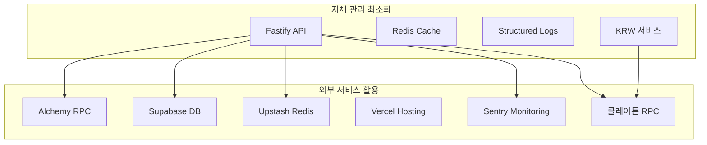

# 1인 개발자 가이드: xStables KRW 특화 운영 전략

## 📋 목차

1. [현실적 스코프 정의](#현실적-스코프-정의)
2. [KRW 특화 운영 전략](#krw-특화-운영-전략)
3. [우선순위별 개발 로드맵](#우선순위별-개발-로드맵)
4. [1인 체제 최적화 스택](#1인-체제-최적화-스택)
5. [운영 자동화 전략](#운영-자동화-전략)
6. [수익화 단계별 접근](#수익화-단계별-접근)
7. [리스크 관리 체계](#리스크-관리-체계)
8. [일일 운영 루틴](#일일-운영-루틴)
9. [성공 지표 및 KPI](#성공-지표-및-kpi)

## 현실적 스코프 정의

### ✅ 꼭 필요한 것 (초기 출시)

#### KRW 특화 핵심 기능
- **KRW 스테이블코인 지원**: KRWx, KRT 등 주요 KRW 스테이블코인
- **견적 소스**: 0x + 1inch API + Uniswap V3 Quoter
- **TTV 엔진**: 가스비 + 수수료 + 슬리피지 → 총비용 계산
- **KRW 최적화**: KRW 직접 vs USD 허브 경유 자동 비교
- **리스크 가드**: 디페그 체크, TVL 임계치, 블랙리스트
- **실행 UX**: approve/permit 가이드 + 서명 버튼
- **로깅**: 요청/응답/오류/절감액 기록

#### 최소 관리 기능
- **간단한 Admin**: 소스 ON/OFF, 수수료 조정, 임계치 설정
- **기본 모니터링**: 에러 알림, 헬스체크, 디페그 알림
- **수익 추적**: 거래량, 수수료, 파트너 수익
- **KRW 특화 대시보드**: KRW 거래 비율, 최적화 성공률

### ❌ 과감히 미루기 (운영 복잡도 큼)

#### 고급 기능 (후순위)
- **MEV 프라이빗 제출**: 번들러 연동 복잡도
- **가스리스 트랜잭션**: 인프라 비용 증가
- **RFQ 네트워크**: 마켓메이커 온보딩 부담
- **크로스체인 브리지**: 멀티체인 복잡도
- **엔터프라이즈 대시보드**: 고객 지원 부담

#### 확장 기능 (성장 후)
- **화이트라벨 SDK**: 초기엔 단순 임베드로 시작
- **고급 분석**: ML 기반 예측
- **모바일 SDK**: 네이티브 앱 지원
- **다국가 지원**: KRW 외 다른 통화 지원

## KRW 특화 운영 전략

### 1. 외부 인프라 최대 활용



### 2. KRW 특화 자동화

#### 자동화된 KRW 최적화
- **라우트 비교**: KRW 직접 vs USD 허브 경유 자동 분석
- **디페그 감지**: 실시간 KRW 페그 모니터링
- **가격 업데이트**: 클레이튼 네이티브 가격 피드
- **수수료 최적화**: KRW 거래에 대한 특별 할인

#### 자동화된 운영
- **헬스체크**: 모든 서비스 상태 모니터링
- **알림 시스템**: 디페그, 에러, 성능 이슈 자동 알림
- **백업**: 데이터베이스 및 설정 자동 백업
- **배포**: CI/CD를 통한 자동 배포

### 3. 자체 상태 단순화

#### 데이터베이스 스키마 (KRW 특화)
```sql
-- 핵심 테이블만 유지
CREATE TABLE krw_quotes (
  id SERIAL PRIMARY KEY,
  token_in VARCHAR(42) NOT NULL,
  token_out VARCHAR(42) NOT NULL,
  amount_in VARCHAR(78) NOT NULL,
  amount_out VARCHAR(78) NOT NULL,
  ttv_usd DECIMAL(18,6) NOT NULL,
  savings_usd DECIMAL(18,6) DEFAULT 0,
  is_direct_better BOOLEAN NOT NULL,
  routes JSONB NOT NULL,
  best_route JSONB NOT NULL,
  krw_optimization JSONB NOT NULL,
  expires_at TIMESTAMP NOT NULL,
  created_at TIMESTAMP DEFAULT NOW()
);

CREATE TABLE krw_transactions (
  id SERIAL PRIMARY KEY,
  user_address VARCHAR(42),
  token_in VARCHAR(42),
  token_out VARCHAR(42),
  amount_in VARCHAR(78),
  amount_out VARCHAR(78),
  ttv_usd DECIMAL(18,6),
  savings_usd DECIMAL(18,6),
  is_krw_direct BOOLEAN,
  created_at TIMESTAMP DEFAULT NOW()
);

CREATE TABLE depeg_alerts (
  id SERIAL PRIMARY KEY,
  token VARCHAR(42) NOT NULL,
  current_price DECIMAL(18,6) NOT NULL,
  target_price DECIMAL(18,6) NOT NULL,
  deviation_bps INTEGER NOT NULL,
  severity INTEGER NOT NULL,
  is_resolved BOOLEAN DEFAULT false,
  created_at TIMESTAMP DEFAULT NOW()
);
```

#### 설정 관리 (환경변수 중심)
```env
# KRW 특화 설정
KRW_DEPEG_THRESHOLD_BPS=50
KRW_ORACLE_UPDATE_INTERVAL=300
KLAYTN_RPC_URL=https://public-node-api.klaytnapi.com/v1/cypress
KRW_STABLES_WHITELIST=0x6270B58BE569a7c0b8f47594F191631Ae5b2C86C,0xceE8FAF64bE97aF5a7016412E8a34b4932325Ee7

# 기본 설정
QUOTE_TTL=30000
MAX_SLIPPAGE_BPS=1000
SERVICE_FEE_BPS=5
PARTNER_SHARE_PERCENT=30
DEFAULT_RISK_THRESHOLD=200
```

## 우선순위별 개발 로드맵

### Phase 1: KRW MVP (1-2개월)

```
Week 1-2: KRW 특화 인프라
├── KRW 스테이블코인 등록
├── 클레이튼 RPC 연동
├── KRW 오라클 설정
└── 기본 디페그 감지

Week 3-4: KRW 최적화 엔진
├── TTV 계산 엔진
├── KRW 직접 vs 허브 경유 비교
├── 실시간 디페그 체크
└── KRW 특화 UI

Week 5-6: 수익화 및 모니터링
├── KRW 거래 수수료 계산
├── 파트너 수익분배
├── 기본 대시보드
└── 알림 시스템

Week 7-8: 안정화
├── 에러 처리
├── 모니터링 강화
├── 성능 최적화
└── 보안 검토
```

### Phase 2: KRW 확장 (3-4개월)

```
Month 3: 고급 KRW 기능
├── 프리미엄 KRW 기능
├── 파트너 대시보드
├── 고급 리스크 관리
└── API 문서화

Month 4: 최적화 및 마케팅
├── KRW 최적화 알고리즘 개선
├── 성능 튜닝
├── 사용자 피드백 반영
└── KRW 시장 마케팅
```

### Phase 3: KRW 성장 (5-6개월)

```
Month 5: 파트너십 확장
├── 화이트라벨 KRW 위젯
├── SDK 개발
├── 파트너 온보딩
└── 수익 최적화

Month 6: 글로벌 확장
├── 추가 KRW 스테이블코인 지원
├── 고급 분석
├── 엔터프라이즈 기능
└── 아시아 시장 확장
```

## 1인 체제 최적화 스택

### 권장 기술 스택

#### 프론트엔드
```typescript
// Next.js 14 + App Router
- SSR/ISR로 SEO 최적화
- 자동 코드 분할
- 내장 이미지 최적화
- Vercel 원클릭 배포

// KRW 특화 상태 관리
- TanStack Query (서버 상태)
- Zustand (클라이언트 상태)
- React Hook Form (폼 관리)
- KRW 특화 훅 (useKRWQuote, useDepegStatus)
```

#### 백엔드
```typescript
// Fastify (Express 대비 2-3배 빠름)
- 내장 스키마 검증
- 자동 JSON 스키마 생성
- 플러그인 생태계
- 낮은 메모리 사용량

// KRW 특화 데이터베이스
- Prisma ORM (타입 안전성)
- PostgreSQL (관계형 데이터)
- Redis (캐싱 + 세션)
- KRW 특화 스키마
```

#### 인프라
```yaml
# 관리형 서비스 활용
Frontend: Vercel (자동 배포, CDN)
Backend: Railway (자동 스케일링)
Database: Supabase (관리형 PostgreSQL)
Cache: Upstash (관리형 Redis)
Monitoring: Sentry (에러 추적)
KRW RPC: 클레이튼 공식 RPC
```

### 개발 도구 최적화

#### 코드 품질
```json
// package.json scripts
{
  "scripts": {
    "dev": "turbo run dev",
    "build": "turbo run build",
    "test": "turbo run test",
    "test:krw": "turbo run test --filter=krw",
    "lint": "turbo run lint",
    "type-check": "turbo run type-check",
    "format": "prettier --write .",
    "clean": "turbo run clean"
  }
}
```

#### 자동화 설정
```yaml
# .github/workflows/ci.yml
name: CI/CD
on: [push, pull_request]
jobs:
  test:
    runs-on: ubuntu-latest
    steps:
      - uses: actions/checkout@v3
      - uses: actions/setup-node@v3
      - run: npm ci
      - run: npm run type-check
      - run: npm run lint
      - run: npm run test
      - run: npm run test:krw
      - run: npm run build
```

## 운영 자동화 전략

### 1. KRW 특화 모니터링 자동화

#### 헬스체크 설정
```typescript
// stable-back/src/routes/health.ts
export async function healthRoutes(fastify: FastifyInstance) {
  fastify.get('/health', async (request, reply) => {
    const checks = await Promise.allSettled([
      checkDatabase(),
      checkRedis(),
      checkExternalAPIs(),
      checkBlockchainRPCs(),
      checkKRWOracle(), // KRW 특화 체크
      checkKlaytnRPC()  // 클레이튼 RPC 체크
    ]);
    
    const healthy = checks.every(check => check.status === 'fulfilled');
    
    return {
      status: healthy ? 'healthy' : 'unhealthy',
      checks: checks.map(check => ({
        service: check.service,
        status: check.status,
        responseTime: check.responseTime
      })),
      krwStatus: await getKRWSystemStatus() // KRW 시스템 상태
    };
  });
}
```

#### KRW 특화 알림 설정
```typescript
// 자동 알림 시스템
const krwAlerts = {
  highErrorRate: { threshold: 5, window: '5m' },
  slowResponse: { threshold: 2000, window: '1m' },
  depegDetected: { threshold: 50, window: '1m' },
  lowLiquidity: { threshold: 100000, window: '5m' },
  krwOptimizationFailure: { threshold: 10, window: '10m' }, // KRW 최적화 실패
  klaytnRPCDown: { threshold: 1, window: '1m' } // 클레이튼 RPC 다운
};
```

### 2. 배포 자동화

#### Vercel 설정
```json
// vercel.json
{
  "buildCommand": "npm run build",
  "outputDirectory": "stable-front/.next",
  "installCommand": "npm install",
  "framework": "nextjs",
  "env": {
    "NEXT_PUBLIC_API_URL": "@api-url",
    "NEXT_PUBLIC_KLAYTN_CHAIN_ID": "8217",
    "NEXT_PUBLIC_KLAYTN_RPC_URL": "@klaytn-rpc"
  }
}
```

#### Railway 설정
```toml
# railway.toml
[build]
builder = "nixpacks"

[deploy]
startCommand = "npm start"
healthcheckPath = "/api/health"
healthcheckTimeout = 100
restartPolicyType = "on_failure"

[env]
KLAYTN_RPC_URL = "https://public-node-api.klaytnapi.com/v1/cypress"
KRW_DEPEG_THRESHOLD_BPS = "50"
```

### 3. KRW 특화 데이터 백업 자동화

#### 데이터베이스 백업
```bash
#!/bin/bash
# krw-backup.sh
DATE=$(date +%Y%m%d_%H%M%S)
pg_dump $DATABASE_URL > krw_backup_$DATE.sql
aws s3 cp krw_backup_$DATE.sql s3://xstables-krw-backups/
rm krw_backup_$DATE.sql

# KRW 특화 데이터 백업
pg_dump $DATABASE_URL --table=krw_quotes --table=krw_transactions --table=depeg_alerts > krw_data_$DATE.sql
aws s3 cp krw_data_$DATE.sql s3://xstables-krw-data/
```

#### 환경 설정 백업
```bash
#!/bin/bash
# krw-env-backup.sh
railway variables --json > krw_env_backup_$(date +%Y%m%d).json
vercel env pull .env.production
```

## 수익화 단계별 접근

### Stage 1: KRW 기본 수익화 (월 $2K 목표)

#### 수익원
- **KRW 거래 수수료**: 0.05% × KRW 거래량
- **파트너 수익분배**: 30% × 파트너 KRW 거래량
- **KRW 최적화 프리미엄**: KRW 직접 스왑 최적화

#### 목표 지표
```
일 KRW 거래량: $100K
월 KRW 거래량: $3M
수수료 수익: $1,500/월
파트너 수익: $450/월
총 수익: $1,950/월
```

### Stage 2: KRW 프리미엄 기능 (월 $8K 목표)

#### 추가 수익원
- **MEV 보호**: $0.5/거래
- **우선 라우팅**: $9.99/월
- **화이트라벨**: $500/월 + 10% 수수료
- **KRW 분석**: $19.99/월

#### 목표 지표
```
기본 수익: $2K/월
프리미엄 기능: $3K/월
화이트라벨: $2K/월
KRW 분석: $1K/월
총 수익: $8K/월
```

### Stage 3: KRW 확장 (월 $25K 목표)

#### 추가 수익원
- **엔터프라이즈**: $2K/월
- **데이터 API**: $500/월
- **컨설팅**: $1K/월
- **KRW 시장 확장**: 아시아 시장

#### 목표 지표
```
기존 수익: $8K/월
엔터프라이즈: $10K/월
데이터/컨설팅: $4K/월
KRW 시장 확장: $3K/월
총 수익: $25K/월
```

## 리스크 관리 체계

### 1. KRW 특화 기술적 리스크

#### KRW 디페그 리스크 관리
```typescript
// Circuit Breaker 패턴 for KRW
class KRWCircuitBreaker {
  private failures = 0;
  private lastFailureTime = 0;
  private state: 'CLOSED' | 'OPEN' | 'HALF_OPEN' = 'CLOSED';
  
  async executeKRWSwap<T>(fn: () => Promise<T>): Promise<T> {
    if (this.state === 'OPEN') {
      if (Date.now() - this.lastFailureTime > 60000) {
        this.state = 'HALF_OPEN';
      } else {
        throw new Error('KRW Circuit breaker is OPEN');
      }
    }
    
    try {
      const result = await fn();
      this.onSuccess();
      return result;
    } catch (error) {
      this.onFailure();
      throw error;
    }
  }
}
```

#### KRW 데이터 손실 방지
```typescript
// KRW 특화 자동 백업 시스템
const krwBackupSchedule = {
  daily: '0 2 * * *',    // 매일 새벽 2시
  weekly: '0 2 * * 0',   // 매주 일요일 새벽 2시
  monthly: '0 2 1 * *'   // 매월 1일 새벽 2시
};
```

### 2. KRW 특화 비즈니스 리스크

#### KRW 규제 리스크 관리
```typescript
// KRW 스테이블코인 규제 체크
const krwComplianceChecks = {
  ofacList: new Set([
    '0x...', // OFAC 제재 주소들
  ]),
  
  krwStableWhitelist: new Set([
    '0x6270B58BE569a7c0b8f47594F191631Ae5b2C86C', // USDC on Klaytn
    '0xceE8FAF64bE97aF5a7016412E8a34b4932325Ee7', // USDT on Klaytn
  ])
};

function isKRWCompliant(address: string): boolean {
  return !krwComplianceChecks.ofacList.has(address.toLowerCase()) &&
         krwComplianceChecks.krwStableWhitelist.has(address.toLowerCase());
}
```

#### KRW 시장 리스크 관리
```typescript
// KRW 디페그 감지 시스템
const krwDepegThresholds = {
  KRWx: 50,  // 0.5%
  KRT: 50,   // 0.5%
  USDC: 50,  // 0.5% (KRW 기준)
  USDT: 50,  // 0.5% (KRW 기준)
};

function checkKRWDepeg(token: string, price: number): boolean {
  const threshold = krwDepegThresholds[token];
  const deviation = Math.abs(price - 1.0) * 10000;
  return deviation > threshold;
}
```

### 3. KRW 특화 운영 리스크

#### KRW 의존성 관리
```typescript
// KRW 특화 외부 API 장애 대응
const krwFallbackProviders = {
  'klaytn': ['alchemy', 'infura'],
  '0x': ['1inch', 'uniswap'],
  '1inch': ['0x', 'uniswap'],
  'uniswap': ['0x', '1inch']
};

async function getKRWQuoteWithFallback(provider: string, params: any) {
  const providers = [provider, ...krwFallbackProviders[provider]];
  
  for (const p of providers) {
    try {
      return await getKRWQuote(p, params);
    } catch (error) {
      console.warn(`KRW Provider ${p} failed:`, error);
      continue;
    }
  }
  
  throw new Error('All KRW providers failed');
}
```

## 일일 운영 루틴

### 매일 (5분)
- [ ] 에러 로그 확인
- [ ] API 응답 시간 체크
- [ ] KRW 디페그 알림 확인
- [ ] KRW 거래량 모니터링
- [ ] 클레이튼 RPC 상태 확인

### 매주 (30분)
- [ ] 파트너 수익 정산
- [ ] KRW 최적화 성능 리뷰
- [ ] 보안 알림 확인
- [ ] 사용자 피드백 검토
- [ ] KRW 시장 동향 분석

### 매월 (2시간)
- [ ] 의존성 업데이트
- [ ] 데이터베이스 최적화
- [ ] 비용 분석
- [ ] 로드맵 업데이트
- [ ] KRW 스테이블코인 목록 업데이트

## 성공 지표 (KPI)

### KRW 특화 기술적 지표
- **가용성**: 99.9% 이상
- **응답 시간**: 95% < 200ms
- **에러율**: < 0.1%
- **견적 정확도**: > 99%
- **KRW 최적화 성공률**: > 95%
- **디페그 감지 정확도**: > 99%

### KRW 특화 비즈니스 지표
- **월 KRW 거래량**: $3M → $30M → $300M
- **KRW 사용자 수**: 1K → 10K → 100K
- **파트너 수**: 5 → 50 → 500
- **월 수익**: $2K → $20K → $200K
- **KRW 거래 비율**: 60% → 80% → 90%

### KRW 특화 운영 지표
- **개발 시간**: 40시간/주 → 20시간/주
- **지원 티켓**: < 5/주
- **시스템 장애**: < 1/월
- **보안 이슈**: 0/월
- **KRW 디페그 이슈**: 0/월

## KRW 특화 성공 전략

### 1. 한국 시장 집중
- **KRW 스테이블코인 전용**: 한국 사용자에게 특화된 서비스
- **클레이튼 네이티브**: 한국 블록체인 생태계 활용
- **한국어 지원**: 완전한 한국어 UI/UX
- **한국 시장 이해**: 원화 기준 가격 표시

### 2. 기술적 우위
- **KRW 최적화**: 다른 서비스보다 저렴한 KRW 거래
- **실시간 디페그 감지**: KRW 스테이블코인 안전성 보장
- **투명한 비용**: 모든 비용을 투명하게 표시
- **논커스터디얼**: 사용자 자금 안전성

### 3. 비즈니스 모델
- **다각적 수익화**: 거래 수수료 + 파트너 분배 + 프리미엄
- **파트너 프로그램**: 함께 성장하는 생태계
- **화이트라벨**: B2B 확장
- **데이터 서비스**: KRW 시장 인사이트

이 가이드를 통해 1인 개발자도 효율적으로 KRW 스테이블코인 특화 xStables를 운영하고 확장할 수 있습니다. 핵심은 **KRW 특화에 집중하면서 점진적으로 기능을 확장**하는 것입니다.